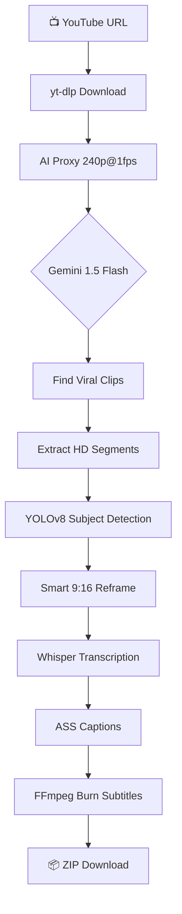

# AI Video Editor - Magic Box SaaS

> One-click YouTube → Viral Reels pipeline with AI captions and smart reframing.

---

## Current Flow (v2)



---

## Architecture

```
┌─────────────────────────────────────────────────────────────┐
│                         FRONTEND                             │
│  Next.js + TypeScript                                        │
│  ┌─────────────┐  ┌─────────────┐  ┌─────────────────────┐  │
│  │ Upload Form │  │ URL Import  │  │ Progress Tracker    │  │
│  │ (Dual Tab)  │  │ (Metadata)  │  │ (Real-time Status)  │  │
│  └─────────────┘  └─────────────┘  └─────────────────────┘  │
└──────────────────────────┬──────────────────────────────────┘
                           │ HTTP/REST
┌──────────────────────────▼──────────────────────────────────┐
│                         BACKEND                              │
│  FastAPI + Celery + Redis                                    │
│  ┌─────────────┐  ┌─────────────┐  ┌─────────────────────┐  │
│  │ YouTube     │  │ Jobs API    │  │ Download API        │  │
│  │ Service     │  │ (Status)    │  │ (ZIP/Preview)       │  │
│  └─────────────┘  └─────────────┘  └─────────────────────┘  │
│                                                              │
│  ┌─────────────────────────────────────────────────────────┐│
│  │                    VIDEO PROCESSOR                       ││
│  │  ┌───────────┐ ┌───────────┐ ┌───────────┐ ┌──────────┐││
│  │  │ AI        │ │ Reframing │ │ Captions  │ │ Layout   │││
│  │  │ Director  │ │ Service   │ │ Service   │ │ Engine   │││
│  │  │ (Gemini)  │ │ (YOLOv8)  │ │ (Whisper) │ │ (Split)  │││
│  │  └───────────┘ └───────────┘ └───────────┘ └──────────┘││
│  └─────────────────────────────────────────────────────────┘│
└─────────────────────────────────────────────────────────────┘
```

---

## Processing Pipeline

| Step | Service | Description | Time |
|------|---------|-------------|------|
| 1 | `YouTubeService` | Download via yt-dlp with caching | 10-60s |
| 2 | `AIDirector` | Generate 240p proxy for Gemini | 5s |
| 3 | `AIDirector` | Find viral clips (Gemini 1.5) | 10s |
| 4 | `FFmpegHandler` | Extract HD segments with loudnorm | 5-20s |
| 5 | `AIReframingService` | YOLOv8 subject detection + 9:16 crop | 10-30s |
| 6 | `CaptionService` | Whisper transcription + ASS | 15-30s |
| 7 | `FFmpegHandler` | Burn subtitles into video | 10s |
| 8 | `VideoProcessor` | Create ZIP of all reels | 2s |

**Total**: ~60-180 seconds for a 10-minute source video.

---

## API Endpoints

### YouTube Import
```
POST /api/youtube/info      → Get video metadata
POST /api/youtube/download  → Start processing job
```

### Job Management
```
GET  /api/jobs/{job_id}     → Get job status + progress
```

### Downloads
```
GET  /api/download/{job_id}         → Single video download
GET  /api/download/zip/{job_id}     → ZIP of all reels
GET  /api/preview/{job_id}/{file}   → Preview individual reel
```

---

## AI Stack

| Component | Model | Purpose |
|-----------|-------|---------|
| **Viral Finder** | Gemini 1.5 Flash | Identify engaging moments |
| **Subject Detection** | YOLOv8 Nano | Track people for reframing |
| **Transcription** | Whisper Base | Word-level captions |
| **Enhancement** | Real-ESRGAN | Upscale low-res clips |

---

## File Structure

```
backend/
├── app/
│   ├── main.py                 # FastAPI app
│   ├── config.py               # Settings from .env
│   ├── celery_app.py           # Celery configuration
│   ├── routes/
│   │   ├── youtube.py          # YouTube import API
│   │   ├── jobs.py             # Job status API
│   │   ├── download.py         # File serving
│   │   └── upload.py           # Local file upload
│   ├── services/
│   │   ├── video_processor.py  # Main orchestrator
│   │   ├── ai_director.py      # Gemini viral detection
│   │   ├── ai_reframing.py     # YOLOv8 + crop
│   │   ├── caption_service.py  # Whisper + ASS
│   │   ├── layout_engine.py    # Split-screen
│   │   ├── ffmpeg_handler.py   # FFmpeg wrapper
│   │   └── youtube_downloader.py
│   └── tasks/
│       └── video_tasks.py      # Celery background tasks
│
frontend/
├── src/
│   ├── app/
│   │   └── page.tsx            # Main dashboard
│   └── components/
│       ├── PodcastUpload.tsx   # Dual-tab upload UI
│       └── ProgressTracker.tsx # Real-time status
```

---

## Environment Setup

### Required in `.env`
```env
GEMINI_API_KEY=your_key_here    # For viral clip detection
REDIS_URL=redis://localhost:6379/0
```

### Start Services
```bash
# Terminal 1: Backend
cd backend
.venv\Scripts\Activate.ps1
uvicorn app.main:app --reload --port 8000

# Terminal 2: Celery Worker
cd backend
.venv\Scripts\Activate.ps1
celery -A app.celery_app.celery_app worker --loglevel=info -P solo

# Terminal 3: Frontend
cd frontend
npm run dev
```

---

## Feature Status

| Feature | Status | Notes |
|---------|--------|-------|
| YouTube Import | ✅ Done | Caching enabled |
| AI Viral Clips | ✅ Done | Requires Gemini API key |
| 9:16 Reframing | ✅ Done | YOLOv8 person tracking |
| AI Captions | ✅ Done | Whisper word-level |
| Split-Screen | ✅ Done | Auto-detect 2 speakers |
| Caption Styles | 🚧 Planned | v2 feature |
| Post-Edit Captions | 🚧 Planned | v2 feature |
| Real-ESRGAN | ⚠️ Partial | Patched for Windows |

---

## Known Issues

1. **Port conflicts**: Kill stale Python processes with `taskkill /F /IM python.exe`
2. **Gemini warning**: Switch to `google.genai` package (deprecated notice)
3. **Windows Celery**: Must use `-P solo` pool

---

## Next Steps (v2)

1. **Caption Style Presets**: TikTok, Hormozi, Neon themes
2. **AI Color Suggestion**: Extract video colors for caption contrast
3. **Post-Preview Editor**: Change caption style after processing
4. **Face-Centric Tracking**: MediaPipe for tighter framing

---

## Future Roadmap (v3+)

### Semantic Video Commands
Natural language editing powered by Vision-Language Models:

```
User: "Make a reel where the cat jumps"
       ↓
┌─────────────────────────────────┐
│ VLM (SmolVLM / Qwen-VL)         │
│ Frame-by-frame scene analysis   │
└───────────────┬─────────────────┘
                ↓
       Timestamps: [12.5s, 45.2s]
                ↓
       Auto-extract + reframe clips
```

**Planned Commands**:
- `"Focus on [object/person]"` → Object-centric reframing
- `"Clip from when they say [quote]"` → Whisper + semantic search
- `"Find the funny moments"` → Engagement scoring via VLM
- `"Remove boring parts"` → Auto-trim low-engagement sections

### Tech Stack for v3
| Component | Model | Purpose |
|-----------|-------|---------|
| Scene Understanding | SmolVLM / Qwen-VL | Natural language video search |
| Object Tracking | SAM 2 (Segment Anything) | Follow specific objects |
| Audio Commands | Whisper + LLM | "Clip when he says X" |

